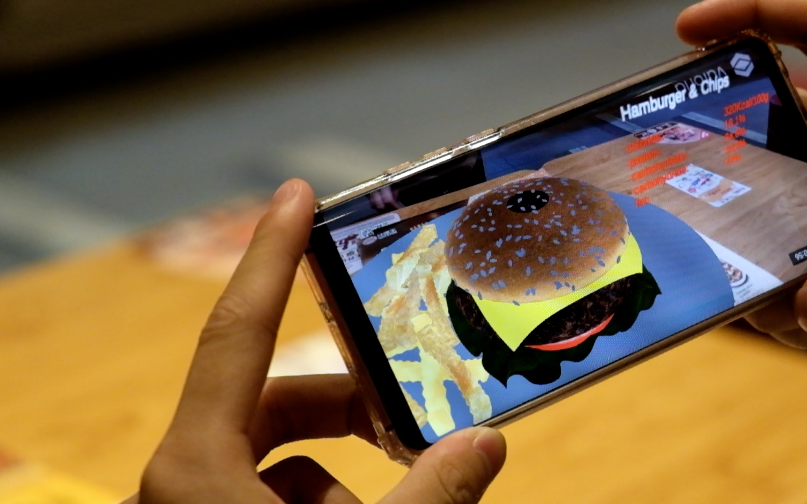
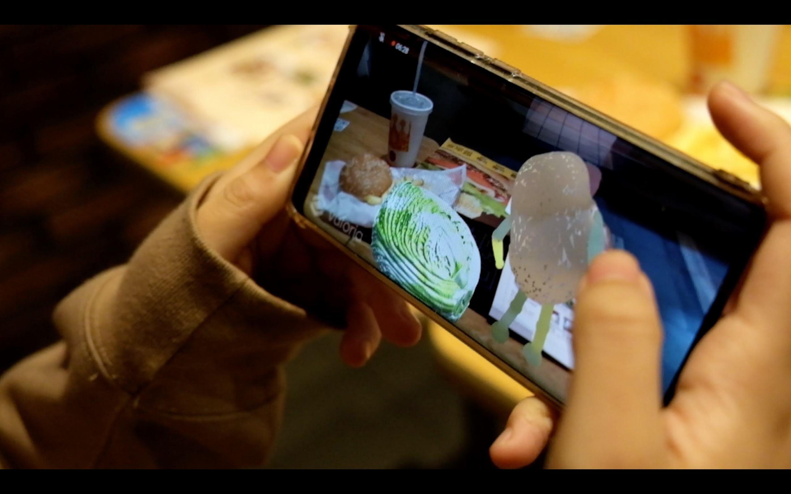

We developed an augmented reality (AR) application using Unity Vuforia, offering customers enhanced information about cuisine. By seamlessly integrating AR technology, we provided an immersive experience that allowed users to explore and learn more about various dishes. Additionally, we focused on designing and optimizing the application interface to ensure a seamless and enjoyable user experience, ultimately driving sales and customer engagement.

