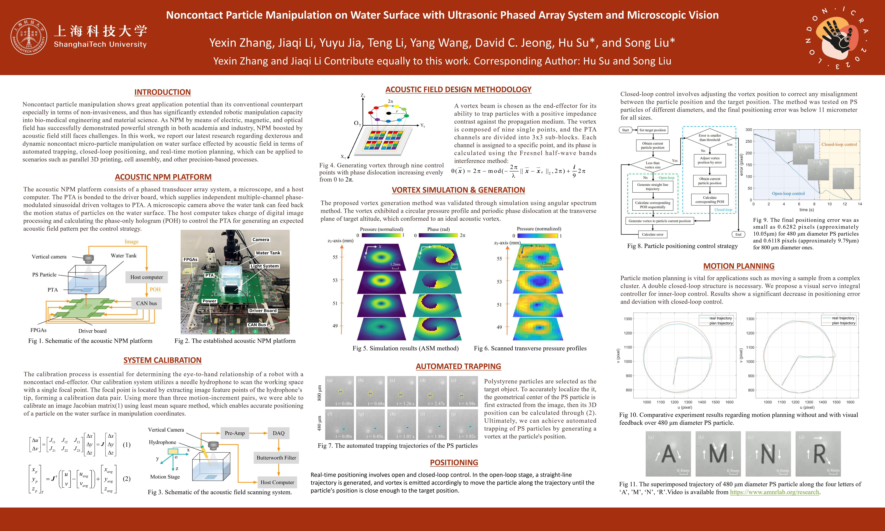

  <video controls style="width: 70%;">
    <source src="../files/icra_demo_video.mp4" type="video/mp4">
    The superimposed trajectory of 480 μm diameter PS particle along the four letters of ‘A’, ’M’, ‘N’, ‘R’.
  </video>

**Abstract**
Noncontact particle manipulation (NPM) shows great application potential than its conventional counterpart particularly in terms of non-invasiveness, and thus has significantly extended robotic manipulation capacity into bio-medical engineering, material science, etc. As NPM by means of electric, magnetic, and optical field has successfully demonstrated powerful strength in both academia and industry, NPM boosted by acoustic field, however, still faces staggering challenges. It is indeed in the very recent years that controllable dynamic airborne or waterborne acoustic field modulation technology emerged in academia. In this paper, we report our latest research regarding dexterous and dynamic noncontact micro-particle manipulation on water surface effected by acoustic field in terms of automated trapping, closed-loop positioning, and real-time motion planning, which can be applied to scenarios such as parallel 3D printing, cell assembly, etc. The main contribution of this work is we demonstrated the feasibility of objective-oriented and fully automated acoustic manipulation of micro-particle in precision scale based on robotic approach in 2D plane. Experiment results showed that the repetitive positioning accuracy can reach as high as 16 μm, which is essentially the pixel scale factor. 

[Download paper here](http://YexinZ1110demicpages.github.io/files/paper_ICRA.pdf)
<!-- Recommended citation:   -->
